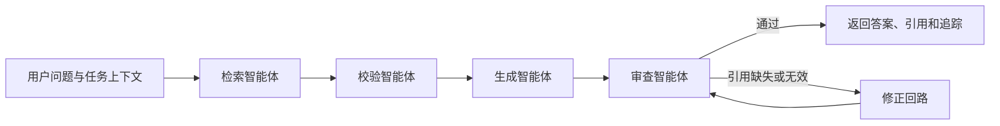

# 基于 RAG 与多智能体的量子计算智能问答

本文档对应商业计划书 4.2.2，说明仓库中的可运行实现、接口和当前边界。

## 处理流程



各节点职责：

1. **检索智能体**：识别概念解释、公式推导、代码纠错、论文分析、游戏攻略或学习路径等任务类型，并从关键词/向量混合索引中宽召回候选片段。
2. **校验智能体**：按照检索分数、问题词项覆盖率和来源权威度重新排序，去除重复片段，并标记低权威来源或资料版本冲突。
3. **生成智能体**：仅使用校验后的上下文生成回答，并根据任务类型选择输出结构；事实性结论必须使用 `[1]`、`[2]` 等引用标记。
4. **审查智能体**：检查回答长度、引用是否存在及引用编号是否有效；不通过时最多触发一次修正，再执行第二次审查。

流水线追踪会记录节点状态、耗时和非敏感统计信息，不记录模型密钥。

## 支持的任务模式

| `mode` | 用途 | 可选结构化输入 |
| --- | --- | --- |
| `concept` | 概念与直觉解释 | `task_context` |
| `derivation` | 公式、证明与分步推导 | `task_context` |
| `code` | Qiskit 代码诊断与修复建议 | `code` |
| `paper` | 论文主张、方法、证据与局限 | `task_context` |
| `comparison` | 概念或技术对比 | `task_context` |
| `troubleshooting` | 故障分析 | `task_context` |
| `game_strategy` | 根据实时状态生成关卡建议 | `game_state` |
| `learning_path` | 根据学习记忆规划阶段路径 | 登录账号的学习记忆 |

当不传 `mode` 时，系统会根据问题关键词自动路由。

### Qiskit 代码纠错

`code` 字段会先经过 Python AST 静态检查。目前能识别语法错误、缺失 Qiskit 导入、空线路和常量量子比特索引越界。检查过程不会导入、运行或编译用户代码，因此响应中的结论会明确区分“静态诊断”和“真实执行结果”。

### 游戏攻略

调用方把当前回合、可用卡牌/量子门、目标态、分数、限制条件等放入 `game_state`。模型只依据该状态和检索资料给出下一步动作、理由、风险及关联量子概念。当前版本不会主动读取游戏进程内状态，后续可由游戏页面在请求时自动附带。

### 学习路径

登录用户的学习水平、目标和薄弱点会作为个性化上下文。回答输出阶段目标、前置知识、练习和掌握度检查；系统给出的是“基于现有证据的推荐路径”，不会宣称是客观最优路径。

## API

### 完整问答

`POST /api/rag/ask`

```json
{
  "question": "这段 Qiskit 代码为什么越界？",
  "mode": "code",
  "code": "from qiskit import QuantumCircuit\nqc = QuantumCircuit(2)\nqc.h(3)",
  "session_id": "optional-session-id",
  "top_k": 5,
  "include_trace": true
}
```

`query` 与 `question` 均可使用，保留 `query` 是为了兼容现有前端。响应包含：

- `answer`、`route`、`confidence`
- `citations` 与校验后的 `contexts`
- `validation` 与 `review`
- `agent_trace`
- `session_id` 与 `response_time_ms`

### 只检索和校验

`POST /api/rag/query`

请求字段与问答接口一致，但仅返回路由、候选数量和校验后的文档片段，不调用大模型。

### 会话历史

```text
GET    /api/rag/history/{session_id}
DELETE /api/rag/history/{session_id}
```

访客历史与登录用户历史分开保存。会话标识应视为不可猜测的访问凭证，不应公开分享。

## 知识库与来源权威度

原始语料位于 `docs/quantum/`，导入后由现有分块、向量索引和关键词索引共同服务检索。校验阶段支持通过文档 metadata 的 `authority_score`（0 到 1）显式指定权威度；未指定时按以下来源信号设置默认值：

- Qiskit / IBM Quantum 官方资料
- 教材与课程资料
- DOI、期刊、OpenAlex、Semantic Scholar
- arXiv 预印本
- 其他本地资料

权威度只参与排序，不等同于事实正确性。对于快速变化的 Qiskit API，应在语料 metadata 中保留版本号和抓取日期。

## 配置

大模型使用 OpenAI 兼容接口，默认读取：

```text
DEEPSEEK_API_KEY
LLM_BASE_URL
LLM_MODEL
LLM_TIMEOUT_SECONDS
LLM_TEMPERATURE
RAG_RETRIEVAL_MODE
```

未配置模型密钥时，纯检索接口仍可使用，完整问答接口返回 `503`。

## 当前边界

- 审查节点当前执行可测试的规则校验，能拦截缺失/越界引用，但不能形式化证明所有量子结论正确。
- 修正回路最多运行一次，避免无限循环和不可控费用。
- Qiskit 分析是静态检查，不执行任意用户代码；真实运行应放入隔离沙箱并设置 CPU、内存与超时限制。
- arXiv、Qiskit 官方文档和教材需要在获得适当授权后持续导入；代码没有自动绕过版权或站点访问限制。
- 游戏攻略依赖调用方提供准确、完整的实时状态。

## 验证

```bash
python -m unittest discover -s tests/rag -v
cd frontend
npm.cmd run build
```

RAG 测试覆盖分块、检索、来源重排、引用输出、审查修正回路和 Qiskit 静态诊断。
